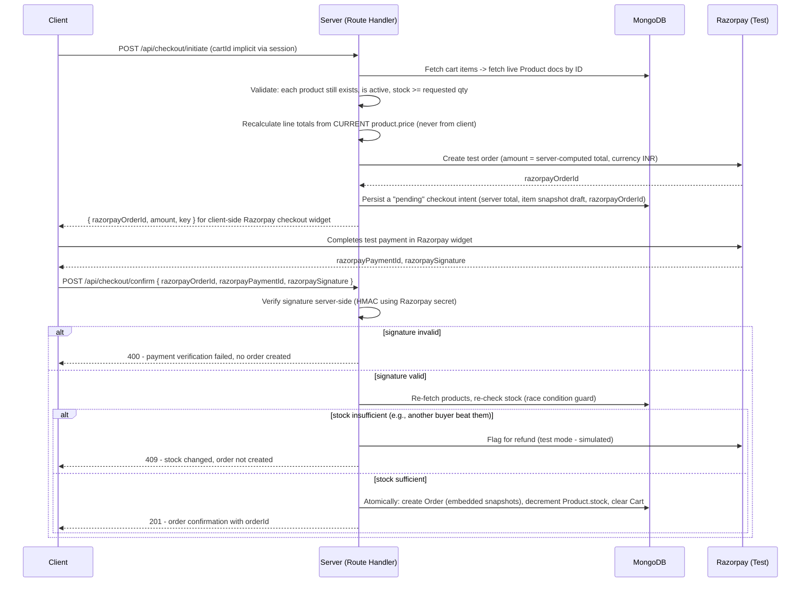

# Architecture — E-Commerce Platform (PRD)

**Document type:** Product/Project Requirements Document (PRD) — Part 2 of 5
**Companion documents:** `project-context.md`, `database-schema.md`, `roadmap.md`, `project-rules.md`
**Covers:** System architecture detail, API route definitions, Order Lifecycle & Checkout Architecture, Project Folder Structure

---

## 1. Architectural Style

**Modular monolith on Next.js App Router**, with a strict internal separation between three execution contexts:

1. **React Server Components (RSC)** — for read-heavy, SEO-relevant pages (catalog, product detail, category listing). Data is fetched directly on the server, no client-side loading spinner, no exposed API surface needed for content that doesn't require interactivity.
2. **Server Actions** — for form-driven mutations tightly coupled to a single page (add to cart, submit review, update quantity). Avoids hand-writing a Route Handler + client `fetch` wrapper for simple, page-local mutations.
3. **Route Handlers (`app/api/**`)** — for anything that needs a stable, addressable HTTP contract: checkout (multi-step, needs explicit request/response shape), admin CRUD (consumed by admin UI tables/forms with pagination), and anything Razorpay/Cloudinary need to callback into.

**Decision rule used throughout the app:** if the mutation is page-local and has no external caller, use a Server Action. If it's part of a multi-step flow, needs to be called from multiple places, or is a webhook/callback target, it's a Route Handler. This avoids the common anti-pattern of wrapping *every* mutation in a REST endpoint "just in case," which bloats the API surface without benefit.

---

## 2. API Architecture — Route Definitions

All routes below are under `/api`. Response envelope is consistent across the API: `{ success: boolean, data?: T, error?: { code: string, message: string } }`.

### 2.1 Public Routes

| Method | Route | Purpose | Auth |
|---|---|---|---|
| GET | `/api/products` | List products — supports `?page`, `?limit`, `?category`, `?minPrice`, `?maxPrice`, `?sort`, `?q` (text search) | Public |
| GET | `/api/products/[slug]` | Single product detail | Public |
| GET | `/api/categories` | List all categories | Public |
| GET | `/api/products/[id]/reviews` | List reviews for a product | Public |

### 2.2 Customer Routes (Authenticated)

| Method | Route | Purpose | Auth |
|---|---|---|---|
| GET | `/api/cart` | Get current user's cart | Customer session |
| POST | `/api/cart/items` | Add item to cart `{ productId, quantity }` | Customer session |
| PATCH | `/api/cart/items/[productId]` | Update quantity | Customer session |
| DELETE | `/api/cart/items/[productId]` | Remove item | Customer session |
| POST | `/api/checkout/initiate` | Server validates cart, recalculates totals, creates a Razorpay test order, returns payment intent details | Customer session |
| POST | `/api/checkout/confirm` | Verifies Razorpay payment signature, creates the immutable Order (with snapshots), decrements stock, clears cart | Customer session |
| GET | `/api/orders` | List current user's orders | Customer session |
| GET | `/api/orders/[id]` | Single order detail (snapshot data) | Customer session, must own the order |
| POST | `/api/products/[id]/reviews` | Submit a review — server checks the user has a delivered order containing this product | Customer session |

### 2.3 Admin Routes

| Method | Route | Purpose | Auth |
|---|---|---|---|
| POST | `/api/admin/products` | Create product | Admin |
| PATCH | `/api/admin/products/[id]` | Update product (price, stock, details) | Admin |
| DELETE | `/api/admin/products/[id]` | Soft-delete product (see `project-rules.md` — hard deletes are disallowed for referenced entities) | Admin |
| POST | `/api/admin/categories` | Create category | Admin |
| PATCH | `/api/admin/categories/[id]` | Update category | Admin |
| DELETE | `/api/admin/categories/[id]` | Delete category (blocked if products reference it — see referential integrity note in `database-schema.md`) | Admin |
| POST | `/api/admin/upload` | Accepts image, forwards to Cloudinary, returns `{ url, publicId }` for the client to attach to a product form | Admin |
| GET | `/api/admin/orders` | List all orders, filterable by status/date | Admin |
| PATCH | `/api/admin/orders/[id]/status` | Update order status (state-machine enforced — see § 3.4) | Admin |
| GET | `/api/admin/analytics/top-customers` | Aggregation: top 5 spenders | Admin |
| GET | `/api/admin/analytics/top-products` | Aggregation: top 10 by quantity sold | Admin |
| GET | `/api/admin/analytics/revenue` | Aggregation: 12-month revenue breakdown | Admin |
| GET | `/api/admin/analytics/low-stock` | Aggregation: products with stock < 5 | Admin |
| GET | `/api/admin/analytics/customer/[id]/orders` | Aggregation: one customer's complete order history | Admin |

### 2.4 Auth Routes

Handled entirely by Auth.js at `/api/auth/[...nextauth]` — not hand-defined; configuration lives in `lib/auth.ts` (see folder structure).

---

## 3. Order Lifecycle & Checkout Architecture

This is the most security-sensitive flow in the application and the clearest expression of the "server is authoritative" principle from `project-context.md`.

### 3.1 The Core Threat Model

A client-side cart is just UI state. Nothing stops a malicious client from:
- Sending `{ productId: "x", price: 1 }` for a ₹50,000 item.
- Sending a quantity that exceeds available stock.
- Replaying an old cart total after the price changed.
- Calling `/api/checkout/confirm` directly without ever calling `/api/checkout/initiate`.

The checkout architecture is designed so that **none of these are possible**, because the server never reads price or totals from the client at any step.

### 3.2 Checkout Sequence



### 3.3 Why Re-Validation Happens Twice (Initiate *and* Confirm)

Time passes between `initiate` and `confirm` — the user is in the Razorpay widget, possibly for minutes. Stock and price are re-checked at `confirm` because:
- Another customer could purchase the last units of a low-stock item in that window.
- An admin could update the price mid-checkout.

The amount charged via Razorpay is locked at `initiate` (that's what the payment gateway processes), so if a discrepancy is found at `confirm`, the order is **not created** and the payment is flagged for reversal rather than silently honoring a stale price — this is discussed further as a trade-off in `project-rules.md`.

### 3.4 Order Status State Machine

```
pending → confirmed → shipped → delivered
   ↓
cancelled   (only allowed from pending or confirmed — not after shipped)
```

Enforced server-side in `PATCH /api/admin/orders/[id]/status` — the handler rejects any transition not present in this graph (e.g., `delivered → pending` is rejected with a 400). This prevents admin UI bugs or direct API calls from corrupting order history integrity, which matters because order status feeds directly into the analytics aggregations in `database-schema.md`.

### 3.5 Atomicity Note

Order creation + stock decrement + cart clear is executed inside a **MongoDB multi-document transaction** (Mongoose session), since these three writes must succeed or fail together — a partial write (order created but stock not decremented) would allow overselling. MongoDB Atlas supports multi-document ACID transactions on replica sets, which Atlas provides by default, so this doesn't require additional infrastructure.

---

## 4. Project Folder Structure (Next.js App Router)

```
ecommerce-app/
├── app/
│   ├── (customer)/                    # Route group: public + customer-facing
│   │   ├── page.tsx                   # Home / landing
│   │   ├── products/
│   │   │   ├── page.tsx               # Catalog listing (RSC, server-fetched)
│   │   │   └── [slug]/page.tsx        # Product detail (RSC)
│   │   ├── categories/[slug]/page.tsx
│   │   ├── cart/page.tsx
│   │   ├── checkout/page.tsx
│   │   └── orders/
│   │       ├── page.tsx               # Order history
│   │       └── [id]/page.tsx          # Order detail (snapshot view)
│   ├── (admin)/
│   │   └── admin/
│   │       ├── page.tsx               # Analytics dashboard
│   │       ├── products/page.tsx
│   │       ├── categories/page.tsx
│   │       └── orders/page.tsx
│   ├── (auth)/
│   │   ├── login/page.tsx
│   │   └── register/page.tsx
│   ├── api/
│   │   ├── auth/[...nextauth]/route.ts
│   │   ├── products/route.ts
│   │   ├── products/[slug]/route.ts
│   │   ├── categories/route.ts
│   │   ├── cart/route.ts
│   │   ├── cart/items/route.ts
│   │   ├── cart/items/[productId]/route.ts
│   │   ├── checkout/initiate/route.ts
│   │   ├── checkout/confirm/route.ts
│   │   ├── orders/route.ts
│   │   ├── orders/[id]/route.ts
│   │   └── admin/
│   │       ├── products/route.ts
│   │       ├── products/[id]/route.ts
│   │       ├── categories/route.ts
│   │       ├── upload/route.ts
│   │       ├── orders/route.ts
│   │       ├── orders/[id]/status/route.ts
│   │       └── analytics/
│   │           ├── top-customers/route.ts
│   │           ├── top-products/route.ts
│   │           ├── revenue/route.ts
│   │           ├── low-stock/route.ts
│   │           └── customer/[id]/orders/route.ts
│   ├── middleware.ts                  # Auth gate + RBAC route protection
│   └── layout.tsx
├── lib/
│   ├── db/
│   │   └── connect.ts                 # Mongoose connection singleton
│   ├── auth.ts                        # Auth.js config (providers, callbacks, adapter)
│   ├── validations/                   # Zod schemas, one file per domain entity
│   │   ├── product.schema.ts
│   │   ├── order.schema.ts
│   │   ├── user.schema.ts
│   │   ├── review.schema.ts
│   │   └── cart.schema.ts
│   ├── cloudinary.ts                  # Upload helper
│   └── razorpay.ts                    # Razorpay client + signature verification
├── models/                            # Mongoose schemas/models (see database-schema.md)
│   ├── User.model.ts
│   ├── Product.model.ts
│   ├── Category.model.ts
│   ├── Order.model.ts
│   ├── Review.model.ts
│   └── Cart.model.ts
├── components/
│   ├── ui/                            # Buttons, inputs, cards - dumb/presentational
│   ├── product/
│   ├── cart/
│   ├── checkout/
│   └── admin/
├── scripts/
│   └── seed.ts                        # Seed data script (see database-schema.md § Seed Strategy)
├── types/
│   └── index.ts                       # Shared TS types (many inferred from Zod schemas)
└── middleware.ts
```

### 4.1 Folder Structure Rationale

- **Route groups `(customer)`, `(admin)`, `(auth)`** — organizational only (no URL impact), used so middleware matchers and mental model stay aligned with the RBAC boundaries defined in `project-context.md`.
- **`lib/validations/` mirrors `models/`** — every Mongoose model has a corresponding Zod schema. This is enforced as a convention (`project-rules.md`) so a schema change is never made in one place and forgotten in the other.
- **`models/` never imported directly into client components** — only Route Handlers, Server Actions, and RSC data-fetching functions touch Mongoose models, keeping the ODM layer strictly server-side (Mongoose is not browser-safe).
- **`scripts/seed.ts` is deliberately outside `app/`** — it's a one-time operational script, not part of the deployed application surface.

---

*Continue to `database-schema.md` for full collection design, embedding/referencing decisions, snapshot pattern, indexing, seed strategy, and analytics pipelines.*