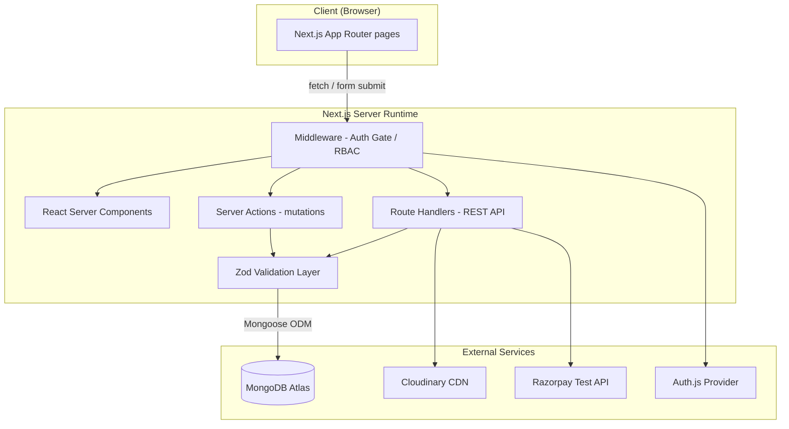

# Project Context — E-Commerce Platform (PRD)

**Document type:** Product/Project Requirements Document (PRD) — Part 1 of 5
**Companion documents:** `architecture.md`, `database-schema.md`, `roadmap.md`, `project-rules.md`
**Status:** Draft v1.0

---

## 1. Document Purpose

This document set expands an academic MongoDB schema-design assignment into a production-oriented, portfolio-grade full-stack e-commerce application. It exists to force the same discipline a real engineering team uses before writing a line of code: agree on scope, agree on data ownership, agree on contracts, *then* build.

This file (`project-context.md`) answers: **what are we building, why, with what, and who can do what.**

---

## 2. Problem Statement

The source assignment was a schema-design exercise: model Users, Products, and Orders correctly, with bonus modeling of Categories, Reviews, and Carts. Schema design on paper is easy to get "technically correct" and still wrong in production — the classic failure mode is treating MongoDB like a relational database (over-normalizing) or the opposite (embedding everything and creating unbounded documents).

This project's real objective is to prove the schema decisions hold up under actual application pressure:

- Can the schema serve a product catalog page without N+1 queries?
- Can an order survive a product being edited or deleted six months later?
- Can the checkout flow resist a client sending manipulated prices?
- Can analytics queries run efficiently against the same collections used for transactional writes?

If the schema only "looks right" in a diagram but breaks under any of the above, the design has failed. This PRD set exists to prevent that.

---

## 3. Executive Summary

A full-stack e-commerce web application built on **Next.js App Router**, with **MongoDB Atlas** as the system of record, **Auth.js** for authentication/RBAC, **Zod** for boundary validation, **Cloudinary** for media, and a **Razorpay test-mode integration** for payment simulation.

Two user roles are supported:

- **Customer** — browses/searches/filters the catalog, manages a cart, checks out through a server-authoritative flow, and views order history.
- **Admin** — manages products, categories, and order lifecycle state, and uploads product imagery.

The system is designed around one non-negotiable principle: **the server is the only source of truth for price, stock, and order state.** The client is treated as untrusted input at every checkout boundary. This mirrors how real e-commerce backends are built and is the single most important architectural decision in this project — everything else (schema, API design, checkout sequencing) supports it.

---

## 4. System Architecture — High Level

The application is a **modular monolith**, not microservices. For a project of this scope, microservices would add operational overhead (service discovery, distributed transactions, network failure handling) without a corresponding benefit — there is one team, one deploy target, and no scaling requirement that demands independent service boundaries. A monolith with strict internal module boundaries (feature-based folder structure, defined in `architecture.md`) gets 90% of the maintainability benefit of microservices at a fraction of the operational cost.

### 4.1 Logical Architecture

### 4.2 Request Flow Principles

| Layer | Responsibility | Trust Level |
|---|---|---|
| Client (Browser) | Rendering, optimistic UI, client-side form UX | **Untrusted** — never authoritative for price/stock/state |
| Middleware | Route protection, session presence check, role gate | Trusted (runs server-side) |
| Route Handlers / Server Actions | Business logic, authorization checks, orchestration | Trusted — single point of authority |
| Zod Validation Layer | Shape + type + constraint enforcement on every inbound payload | Trusted — the actual gate |
| MongoDB Atlas | Persistence, indexing, aggregation | Trusted — final state |
| Cloudinary | Image storage/delivery only, never business logic | Trusted for media only |
| Razorpay (test mode) | Simulated payment intent/confirmation | Trusted for payment status only |

The core rule that flows through every later document: **anything crossing from client to server is treated as hostile until validated.** Price, stock, discounts, totals — none of these are ever accepted from the client verbatim. This is elaborated fully in `architecture.md` (Order Lifecycle) and enforced as a hard rule in `project-rules.md`.

---

## 5. Technology Stack & Reasoning

| Layer | Choice | Why This, Not the Alternative |
|---|---|---|
| Framework | **Next.js (App Router)** | Single deployable for UI + API (Route Handlers), React Server Components reduce client JS for catalog pages (SEO + performance), built-in file-based routing removes need for a separate Express server. Alternative (separate React SPA + Express API) doubles deployment surface and duplicates auth/session logic for no benefit at this scale. |
| Language | **TypeScript** | Compile-time contract enforcement between DB schema, API payloads, and UI props. Given the schema has nested embedded documents (snapshots, addresses), untyped JS would silently allow shape drift between what's stored and what's read. |
| Styling | **Tailwind CSS** | Utility-first avoids CSS file sprawl across a catalog/cart/checkout/admin surface; enables consistent design tokens (spacing, color) without a separate design-system build step. |
| Database | **MongoDB Atlas** | Matches the source assignment's document model. Document shape fits the domain naturally: a Product is a document, an Order is a document with embedded snapshot data — this is the *reason* MongoDB was chosen for the schema assignment in the first place, and the app must honor that, not fight it with relational patterns. |
| ODM | **Mongoose** | Schema enforcement at the application layer (MongoDB itself is schema-flexible, which is a liability without a governing layer), built-in validators, middleware hooks (e.g., pre-save stock checks), and populated relationships for the referenced collections (Categories). |
| Auth | **Auth.js (NextAuth)** | Native Next.js integration, session strategy compatible with middleware-based route protection, credential + OAuth extensibility if needed later. Avoids hand-rolling JWT issuance/refresh, which is a common source of security bugs in student/portfolio projects. |
| Validation | **Zod** | Single schema definition reused for form validation (client) and API payload validation (server) — reduces duplication and guarantees the server never trusts a payload the client "already validated." TypeScript types are inferred directly from Zod schemas (`z.infer`), keeping types and runtime validation in sync. |
| Media Storage | **Cloudinary** | Product images must not live in MongoDB (document size limits, no CDN, no transformation pipeline). Cloudinary provides upload, CDN delivery, and on-the-fly transformation (thumbnails, responsive sizes) without building custom image infrastructure. |
| Payments | **Razorpay (Test/Mock Mode)** | Indian-market-relevant gateway (INR-native, UPI/cards), and test mode allows a fully realistic checkout *sequence* (order creation → payment intent → verification webhook/callback → confirmation) without handling real money — appropriate for a portfolio project that still wants to demonstrate correct payment-flow architecture, not a toy `isPaid: true` flag. |

### 5.1 Deliberately Excluded (and Why)

| Considered | Excluded Because |
|---|---|
| Redis caching layer | Adds infra complexity disproportionate to a single-instance deployment; noted as a **future phase**, not a v1 requirement (see `roadmap.md`). |
| GraphQL API | REST Route Handlers are sufficient for the surface area (catalog, cart, orders, admin); GraphQL's benefit (flexible client queries) isn't needed when the frontend and API are co-located in the same Next.js app. |
| Microservices split | Covered above — no independent scaling or team-boundary need exists at this stage. |
| Separate admin app/repo | Admin is a role, not a separate product — shares the same schema, auth session, and most UI primitives. A separate app would duplicate auth and increase deployment surface for no isolation benefit. |

---

## 6. Application Features

### 6.1 Customer-Facing Features

| Feature | Description |
|---|---|
| Authentication | Sign up, log in, log out via Auth.js; session-based route protection. |
| Catalog Browsing | Paginated product listing, category filtering, price-range filtering, sort (price asc/desc, newest). |
| Search | Text search across product name/description (MongoDB text index — see `database-schema.md`). |
| Product Detail | Full product view including images, price, stock status, category, and reviews. |
| Cart Management | Add/remove/update quantity; cart persists per user (not per session) so it survives login on another device. |
| Checkout | Address entry, order summary, mock payment via Razorpay test flow, server-side price/stock re-validation (see `architecture.md`). |
| Order History | List of past orders with status, and per-order detail showing the **snapshot** of what was actually purchased (see Snapshot Pattern in `database-schema.md`). |
| Reviews (bonus) | Submit a rating/comment on a purchased product. |

### 6.2 Admin-Facing Features

| Feature | Description |
|---|---|
| Product CRUD | Create/edit/delete products, set stock and price, assign category. |
| Category CRUD | Create/edit/delete categories used for catalog filtering. |
| Image Upload | Upload product images directly to Cloudinary from the admin UI; store returned CDN URL/public ID on the Product document. |
| Order Management | View all orders, update order status (`pending → confirmed → shipped → delivered`, or `cancelled`). |
| Analytics Dashboard | Top-spending customers, best-selling products, monthly revenue, low-stock alerts — full logic in `database-schema.md` § Analytics. |

---

## 7. Auth & RBAC Strategy

### 7.1 Roles

Two roles only, stored as an enum field on the `User` document (`role: "customer" | "admin"`). No role hierarchy beyond this — an admin is not a superset customer; admin-only routes are simply gated separately.

### 7.2 Session Strategy

- Auth.js with a **database session strategy** (sessions persisted via the MongoDB adapter), not pure stateless JWT, because order/cart operations benefit from server-side session invalidation (e.g., admin can force-logout a compromised account — not in v1 scope, but the strategy leaves the door open).
- Session payload carries `userId` and `role` only. No sensitive data (address, payment info) is cached in the session token.

### 7.3 Route Protection Model

| Route Group | Access Rule | Enforced At |
|---|---|---|
| `/`, `/products/*`, `/categories/*` | Public | No gate |
| `/cart`, `/checkout`, `/orders/*` | Authenticated (any role) | Middleware — redirect to `/login` if no session |
| `/admin/*` | Authenticated **and** `role === "admin"` | Middleware — 403 / redirect if role mismatch |
| API Route Handlers (mutations) | Re-checked **inside the handler**, not just middleware | Route Handler — see rationale below |

### 7.4 Why RBAC Is Checked Twice (Middleware + Handler)

Middleware protects *pages* (UX-level gating — don't even render the admin dashboard shell to a customer). It does **not** replace authorization checks inside Route Handlers, because:

1. Route Handlers can be called directly (not just via UI navigation) — middleware must cover API paths too, but defense-in-depth means the handler itself re-validates `session.user.role` before executing any admin mutation.
2. This prevents a class of bug where middleware matcher configuration silently excludes a new route (e.g., a newly added `/admin/products/bulk-delete` route) from protection — the handler-level check is the last line of defense regardless of routing config correctness.

This "never trust the layer above you" principle is the same one applied to checkout pricing (`architecture.md`) and is treated as a hard rule in `project-rules.md`.

---

## 8. Non-Goals (Explicitly Out of Scope for v1)

- Multi-vendor/marketplace support (single-seller model only).
- Real payment processing (Razorpay stays in test mode by design).
- Multi-currency (INR only, per seed data strategy).
- Wishlist, coupons/discount codes, and recommendation engine — flagged as future phases in `roadmap.md`, not core requirements.
- Horizontal scaling / multi-region deployment.

---

*Continue to `architecture.md` for system-level design, API contracts, checkout sequencing, and folder structure.*