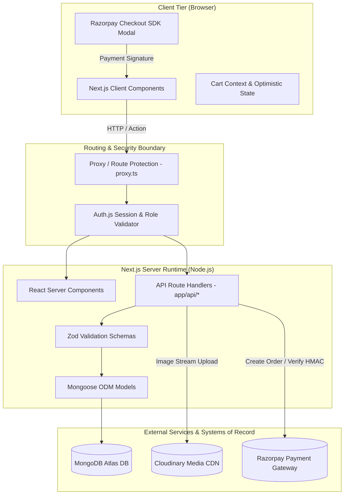
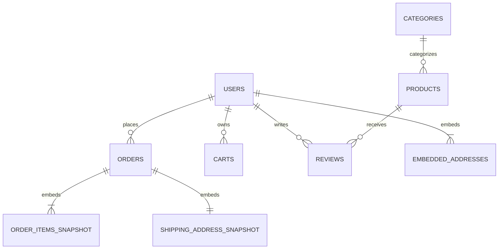
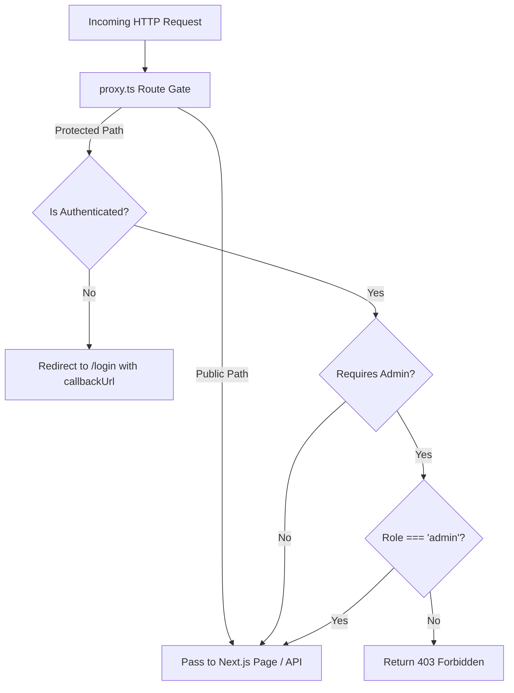
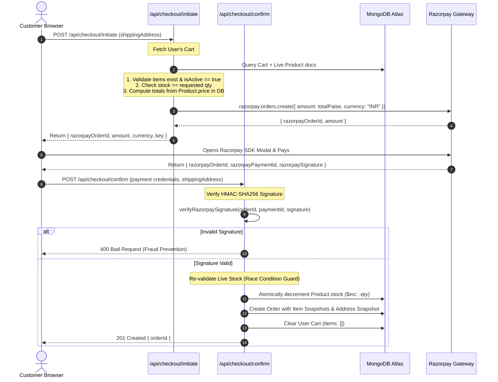
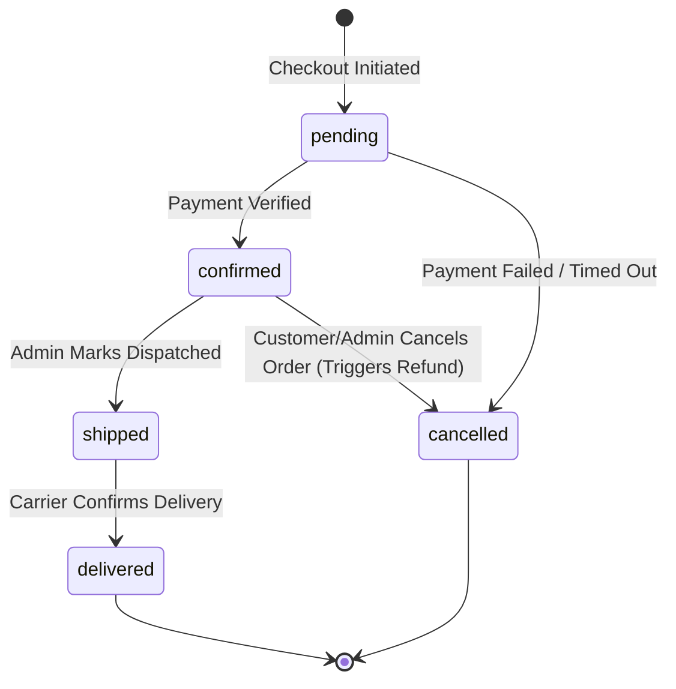

# E-Commerce Platform — Codebase Wiki & System Architecture

> **Comprehensive Developer Guide, System Architecture & Operational Manual**  
> *Stack: Next.js 16 (App Router) · React 19 · TypeScript · MongoDB Atlas (Mongoose 9) · Auth.js v5 · Zod · Cloudinary · Razorpay · Tailwind CSS v4*

---

## Table of Contents

1. [Executive Summary & Core Philosophy](#1-executive-summary--core-philosophy)
2. [High-Level System Architecture](#2-high-level-system-architecture)
3. [Repository & Directory Structure](#3-repository--directory-structure)
4. [Database Design & Data Models (MongoDB Atlas)](#4-database-design--data-models-mongodb-atlas)
5. [Authentication & Authorization (RBAC)](#5-authentication--authorization-rbac)
6. [Core Business Logic & Workflows](#6-core-business-logic--workflows)
   - [6.1 Server-Authoritative Checkout & Payment Flow](#61-server-authoritative-checkout--payment-flow)
   - [6.2 Order Lifecycle State Machine](#62-order-lifecycle-state-machine)
   - [6.3 Product & Media Management (Cloudinary)](#63-product--media-management-cloudinary)
   - [6.4 Review Aggregation Pipeline](#64-review-aggregation-pipeline)
   - [6.5 Admin Analytics Aggregations](#65-admin-analytics-aggregations)
7. [API Route Specifications](#7-api-route-specifications)
8. [Data Validation & Type Safety Layer](#8-data-validation--type-safety-layer)
9. [Frontend Architecture & Component Tree](#9-frontend-architecture--component-tree)
10. [Environment Variables & Security Configuration](#10-environment-variables--security-configuration)
11. [Setup, Seeding & Development Guide](#11-setup-seeding--development-guide)

---

## 1. Executive Summary & Core Philosophy

This project is a production-grade, full-stack e-commerce application designed to demonstrate robust database schema design, defensive API architecture, server-authoritative transactional workflows, and role-based access control.

### Core Engineering Principles

1. **Server-Authoritative Source of Truth:**
   The client is treated as an untrusted environment. Product prices, discounts, tax rates, inventory counts, and order totals are **never** accepted directly from client payloads. The server re-fetches product documents, recalculates line totals, and validates live inventory before creating payment orders or completing checkouts.

2. **Immutable Snapshot Pattern:**
   Purchases represent point-in-time financial contracts. An order must remain completely unaltered even if a product's price changes, its title is renamed, or a user changes their shipping address months later. All purchase-relevant details (`nameSnapshot`, `priceSnapshot`, `shippingAddressSnapshot`, line totals) are embedded directly within the `Order` document.

3. **Modular Monolith Execution Contexts:**
   The application leverages Next.js 16 App Router divided into three specific runtime contexts:
   - **React Server Components (RSC):** Read-heavy pages (catalog, product detail, dashboard stats) rendered on the server with direct database connectivity.
   - **Server Actions:** Form-driven mutations scoped to specific pages (e.g., registration actions).
   - **Route Handlers (`app/api/**`):** REST endpoints providing structured JSON contracts for multi-step flows (checkout, admin CRUD, external callbacks).

4. **Paise-Precision Currency Representation:**
   To eliminate floating-point rounding errors inherent to JavaScript IEEE 754 numbers, all financial values (product prices, subtotal, tax, total amount) are stored as integer **paise** (1 INR = 100 paise). Conversion to Rupees (`₹`) is performed strictly at the presentation layer.

---

## 2. High-Level System Architecture



### Request Flow Security Model

| Boundary Layer | Responsibility | Security Stance |
| :--- | :--- | :--- |
| **Browser (Client)** | Interactive UI, state management, form inputs | **Untrusted** |
| **`proxy.ts`** | Path matching, session check, admin route gating | Trusted (edge/server) |
| **Route Handlers** | Business rules, role re-validation, transaction orchestration | Trusted (authoritative) |
| **Zod Schemas** | Strict runtime type-checking, payload sanitization, range checks | Trusted (boundary gate) |
| **Mongoose Models** | Schema validation, schema indexing, DB operations | Trusted (ORM level) |
| **MongoDB Atlas** | Data persistence, atomic transactions, aggregations | System of Record |

---

## 3. Repository & Directory Structure

```text
e-commerce/
├── app/                                 # Next.js App Router root
│   ├── (admin)/                         # Admin Route Group
│   │   └── admin/                       # Admin panel routes
│   │       ├── analytics/               # Aggregation dashboards
│   │       ├── categories/              # Category CRUD management
│   │       ├── orders/                  # Order fulfillment & status updates
│   │       ├── products/                # Product CRUD & Cloudinary upload
│   │       │   ├── [id]/                # Edit product
│   │       │   ├── new/                 # Create product
│   │       │   └── page.tsx             # Products listing table
│   │       ├── users/                   # Customer management
│   │       ├── layout.tsx               # Admin sidebar & header layout
│   │       └── page.tsx                 # Admin dashboard overview
│   ├── (auth)/                          # Authentication Route Group
│   │   ├── login/page.tsx               # Credentials login page
│   │   └── register/                    # User registration
│   │       ├── actions.ts               # Registration Server Action
│   │       └── page.tsx                 # Registration UI
│   ├── (customer)/                      # Customer-Facing Route Group
│   │   ├── cart/page.tsx                # Shopping cart & checkout trigger
│   │   ├── categories/[slug]/page.tsx   # Category-filtered product list
│   │   ├── orders/                      # Customer order history
│   │   │   ├── [id]/page.tsx            # Order confirmation & snapshot details
│   │   │   └── page.tsx                 # Order list
│   │   ├── products/                    # Product catalog
│   │   │   ├── [slug]/page.tsx          # Product details, reviews, add to cart
│   │   │   └── page.tsx                 # Catalog with filter bar & search
│   │   └── profile/page.tsx             # Customer profile & addresses
│   ├── api/                             # REST API Route Handlers
│   │   ├── admin/                       # Admin-only endpoints
│   │   │   ├── analytics/               # Aggregation reporting endpoints
│   │   │   ├── categories/              # Category management API
│   │   │   ├── orders/                  # Order status transition API
│   │   │   ├── products/                # Product mutation API
│   │   │   └── upload/                  # Cloudinary image upload stream
│   │   ├── auth/[...nextauth]/route.ts  # Auth.js API route handler
│   │   ├── cart/                        # Cart read & clear API
│   │   │   └── items/                   # Cart item CRUD endpoints
│   │   ├── categories/                  # Public categories API
│   │   ├── checkout/                    # Checkout & Payment API
│   │   │   ├── initiate/                # Validation & Razorpay order generation
│   │   │   └── confirm/                 # Signature verification & Order creation
│   │   ├── orders/                      # Customer orders API
│   │   └── products/                    # Public product search & catalog API
│   ├── favicon.ico
│   ├── globals.css                      # Tailwind CSS v4 & theme variables
│   ├── layout.tsx                       # Root HTML shell & global providers
│   └── page.tsx                         # Landing homepage with featured items
├── components/                          # Reusable UI Components
│   ├── admin/                           # Admin-specific components
│   │   ├── AdminSearchInput.tsx         # Real-time search filter
│   │   └── ProductForm.tsx              # Product create/edit form with upload
│   ├── cart/                            # Shopping cart components
│   │   ├── AddToCartButton.tsx          # Interactive add to cart button
│   │   └── CartContext.tsx              # React Context for client cart count
│   ├── checkout/                        # Razorpay modal & checkout forms
│   ├── product/                         # Product components
│   │   ├── FilterBar.tsx                # Price, category, and sorting filters
│   │   └── ProductCard.tsx              # Product display tile
│   └── ui/                              # Global UI building blocks
│       └── Navbar.tsx                   # Top navigation with user/admin status
├── lib/                                 # Shared Utilities & Business Services
│   ├── auth.ts                          # Auth.js configuration & RBAC guards
│   ├── cloudinary.ts                    # Cloudinary SDK buffer stream helper
│   ├── razorpay.ts                      # Razorpay client & HMAC SHA256 verification
│   ├── db/
│   │   └── connect.ts                   # Cached Mongoose connection helper
│   └── validations/                     # Zod Validation Schemas
│       ├── cart.schema.ts
│       ├── category.schema.ts
│       ├── order.schema.ts
│       ├── product.schema.ts
│       ├── review.schema.ts
│       └── user.schema.ts
├── models/                              # Mongoose Schemas & Models
│   ├── Cart.model.ts                    # Cart collection schema
│   ├── Category.model.ts                # Category collection schema
│   ├── Order.model.ts                   # Order collection schema with snapshots
│   ├── Product.model.ts                 # Product catalog schema
│   ├── Review.model.ts                  # Review & rating schema
│   └── User.model.ts                    # User & embedded address schema
├── public/                              # Static public assets
├── scripts/                             # Operational & Seed Scripts
│   ├── promote-admin.ts                 # CLI tool to promote users to admin
│   └── seed.ts                          # Database seeder with realistic test data
├── types/
│   └── index.ts                         # Global TypeScript type extensions
├── proxy.ts                             # Next.js 16 Edge Route Protection Proxy
├── package.json                         # Project dependencies & scripts
├── tsconfig.json                        # TypeScript compiler options
└── tsconfig.seed.json                   # ts-node configuration for seeder
```

---

## 4. Database Design & Data Models (MongoDB Atlas)

The database design strikes an optimal balance between **embedded subdocuments** (for bounded, high-locality, point-in-time data) and **referenced collections** (for independently managed or unbounded entities).



### 4.1 Collections & Schema Specifications

#### 1. `User` Collection (`models/User.model.ts`)
- **Purpose:** User authentication, role assignment, and saved addresses.
- **Key Fields:**
  - `name`: String (required)
  - `email`: String (required, unique, lowercased, indexed)
  - `passwordHash`: String (bcrypt hash; omitted in API responses)
  - `role`: Enum `["customer", "admin"]` (default `"customer"`)
  - `addresses`: Array of Embedded Address subdocuments (`label`, `line1`, `line2`, `city`, `state`, `pincode`, `isDefault`)

#### 2. `Category` Collection (`models/Category.model.ts`)
- **Purpose:** Hierarchical taxonomy for products.
- **Key Fields:**
  - `name`: String (required, unique, trimmed)
  - `slug`: String (required, unique, lowercased URL slug)
  - `description`: String (optional)

#### 3. `Product` Collection (`models/Product.model.ts`)
- **Purpose:** The catalog master.
- **Key Fields:**
  - `name`: String (required, text indexed)
  - `slug`: String (required, unique, text indexed)
  - `description`: String (required, text indexed)
  - `price`: Number (integer in **paise**, min: 0)
  - `stock`: Number (integer inventory count, min: 0)
  - `categoryId`: ObjectId (referenced to `Category`, indexed)
  - `images`: Array of `{ url: string, publicId: string }` (Cloudinary references)
  - `isActive`: Boolean (default `true`; soft-delete flag)
  - `ratingAvg`: Number (denormalized calculated average: 0 to 5)
  - `ratingCount`: Number (denormalized review tally)

#### 4. `Order` Collection (`models/Order.model.ts`)
- **Purpose:** Immutable, auditable records of completed transactions.
- **Key Fields:**
  - `userId`: ObjectId (referenced to `User`, indexed)
  - `items`: Array of `IOrderItemSnapshot`
    - `productId`: ObjectId (reference retained for analytics)
    - `nameSnapshot`: String (product name at time of checkout)
    - `priceSnapshot`: Number (unit price in paise at time of checkout)
    - `quantity`: Number (integer >= 1)
    - `lineTotal`: Number (`priceSnapshot * quantity`)
  - `shippingAddressSnapshot`: Complete deep copy of the address subdocument
  - `subtotal`, `tax`, `total`: Number (integers in paise, calculated server-side)
  - `status`: Enum `["pending", "confirmed", "shipped", "delivered", "cancelled"]` (indexed)
  - `payment`: Subdocument `{ razorpayOrderId, razorpayPaymentId, status: ["created", "paid", "failed", "refunded"] }`

#### 5. `Review` Collection (`models/Review.model.ts`)
- **Purpose:** Customer feedback and star ratings.
- **Key Fields:**
  - `productId`: ObjectId (referenced to `Product`, compound indexed with `userId`)
  - `userId`: ObjectId (referenced to `User`)
  - `rating`: Number (integer 1 to 5)
  - `comment`: String (optional)
- **Constraint:** Compound unique index `{ productId: 1, userId: 1 }` prevents multiple reviews per user on a single product.

#### 6. `Cart` Collection (`models/Cart.model.ts`)
- **Purpose:** Temporary holding area for pre-checkout customer intent.
- **Key Fields:**
  - `userId`: ObjectId (unique, referenced to `User`)
  - `items`: Array of `{ productId: ObjectId, quantity: number }`

### 4.2 Indexing Strategy for High Throughput

| Collection | Index Fields | Index Type / Purpose |
| :--- | :--- | :--- |
| `users` | `{ email: 1 }` | Unique lookup for authentication |
| `categories` | `{ slug: 1 }`, `{ name: 1 }` | Unique index for routing and fast categorization |
| `products` | `{ slug: 1 }` | Unique index for product detail URL routing |
| `products` | `{ categoryId: 1, price: 1 }` | Compound index for filtered and sorted catalog browsing |
| `products` | `{ name: "text", description: "text" }` | MongoDB Full-Text Search index |
| `products` | `{ stock: 1 }`, `{ price: 1 }` | Fast range queries for admin alerts & price filters |
| `orders` | `{ userId: 1, createdAt: -1 }` | Compound index for customer order history pagination |
| `orders` | `{ status: 1, createdAt: -1 }` | Admin order management & filtering |
| `orders` | `{ "payment.razorpayOrderId": 1 }` | Fast lookup during payment confirmation webhooks/callbacks |
| `reviews` | `{ productId: 1, userId: 1 }` | Unique compound index (one review per product per user) |
| `carts` | `{ userId: 1 }` | Unique index for fast 1-to-1 cart retrieval |

---

## 5. Authentication & Authorization (RBAC)

The application uses **Auth.js v5 (NextAuth)** with a stateless **JWT session strategy** and custom credentials verification.



### 5.1 Route Protection Matrix (`proxy.ts`)

In Next.js 16, route protection is centralized in [proxy.ts](file:///D:/2_Learning/Internship%20projects/e-commerce/proxy.ts):

| Path Pattern | Allowed Roles | Unauthenticated Behavior |
| :--- | :--- | :--- |
| `/`, `/products/**`, `/categories/**` | Public (All) | Allowed |
| `/login`, `/register` | Public (All) | Allowed |
| `/cart/**`, `/orders/**`, `/profile` | Authenticated Customer / Admin | Redirect to `/login?callbackUrl=...` |
| `/admin/**` | Admin Only (`role === "admin"`) | Non-admin: `403 Forbidden` / Unauth: Redirect `/login` |
| `/api/cart/**`, `/api/checkout/**`, `/api/orders/**` | Authenticated Users | `401 Unauthorized` JSON |
| `/api/admin/**` | Admin Only | `401 Unauthorized` or `403 Forbidden` JSON |

### 5.2 Defense-in-Depth Guard Helpers (`lib/auth.ts`)

In addition to proxy-level interception, every Route Handler independently enforces authorization:
- [`requireAdmin()`](file:///D:/2_Learning/Internship%20projects/e-commerce/lib/auth.ts#L74-L87): Resolves session and asserts `session.user.role === "admin"`. Returns `403 Forbidden` response immediately if failed.
- [`requireAuth()`](file:///D:/2_Learning/Internship%20projects/e-commerce/lib/auth.ts#L92-L102): Resolves session and extracts authenticated `userId` and `role`. Returns `null` if unauthenticated.

---

## 6. Core Business Logic & Workflows

### 6.1 Server-Authoritative Checkout & Payment Flow



#### Key Implementation Details:
- **Price Integrity:** Prices are fetched directly from MongoDB; client prices are discarded.
- **Stock Reservation & Atomic Decrement:** Inventory is decremented atomically during order confirmation using MongoDB `$inc` operators.
- **HMAC Verification:** Signatures are verified using `crypto.createHmac("sha256", RAZORPAY_KEY_SECRET)` on the string `${razorpayOrderId}|${razorpayPaymentId}`.

---

### 6.2 Order Lifecycle State Machine

Order status transitions must strictly adhere to the defined finite state machine. Out-of-order or invalid transitions (such as transitioning from `delivered` back to `pending`) are strictly rejected.



---

### 6.3 Product & Media Management (Cloudinary)

1. Product images are uploaded by admins via the admin UI.
2. The endpoint [`/api/admin/upload`](file:///D:/2_Learning/Internship%20projects/e-commerce/app/api/admin/upload) receives multipart form data as a byte stream in memory.
3. The buffer is piped directly into Cloudinary using `cloudinary.uploader.upload_stream`.
4. Only the resultant `secure_url` and `public_id` are saved in the database under `Product.images`. No binary media data is stored in MongoDB.
5. **Soft Delete Rule:** When a product is deleted by an admin, the system flags `isActive: false` rather than executing a hard document deletion. This guarantees historical orders can always resolve reference queries.

---

### 6.4 Review Aggregation Pipeline

When a customer submits a product review:
1. The server checks that the user has at least one **delivered** order containing the specified `productId`.
2. The review is written to the `reviews` collection.
3. A MongoDB aggregation pipeline recalculates the average rating and review count:
   ```typescript
   const stats = await Review.aggregate([
     { $match: { productId: new mongoose.Types.ObjectId(productId) } },
     { $group: { _id: "$productId", avgRating: { $avg: "$rating" }, totalCount: { $sum: 1 } } }
   ]);
   await Product.findByIdAndUpdate(productId, {
     ratingAvg: Math.round((stats[0]?.avgRating || 0) * 10) / 10,
     ratingCount: stats[0]?.totalCount || 0
   });
   ```

---

### 6.5 Admin Analytics Aggregations

The admin analytics engine runs optimized MongoDB aggregation pipelines:

1. **Top Spenders (`/api/admin/analytics/top-customers`):**
   Aggregates completed orders grouped by `userId`, sums total spend, and joins user profile info via `$lookup`.
2. **Top Selling Products (`/api/admin/analytics/top-products`):**
   Unwinds order items, groups by `items.productId`, and computes total units sold and revenue.
3. **Monthly Revenue Breakdown (`/api/admin/analytics/revenue`):**
   Groups paid orders by year-month (`$dateToString: { format: "%Y-%m", date: "$createdAt" }`) and calculates 12-month trailing gross revenue.
4. **Low Stock Inventory Alert (`/api/admin/analytics/low-stock`):**
   Queries active products where `stock <= 5` for proactive replenishment.

---

## 7. API Route Specifications

All API responses follow a standardized JSON envelope:
```json
{
  "success": true,
  "data": { ... }
}
```
Or for errors:
```json
{
  "success": false,
  "error": {
    "code": "ERROR_CODE_STRING",
    "message": "Human-readable explanation"
  }
}
```

### 7.1 Public Endpoints

| Method | Endpoint | Description | Query Parameters |
| :--- | :--- | :--- | :--- |
| `GET` | `/api/products` | Paginated product search & catalog | `q`, `category`, `minPrice`, `maxPrice`, `sort`, `page`, `limit` |
| `GET` | `/api/products/[slug]` | Product details by slug | — |
| `GET` | `/api/categories` | All active categories | — |
| `GET` | `/api/products/[id]/reviews` | Reviews list for a product | `page`, `limit` |

### 7.2 Customer Endpoints (Authenticated)

| Method | Endpoint | Description | Payload |
| :--- | :--- | :--- | :--- |
| `GET` | `/api/cart` | Get current user's active cart | — |
| `POST` | `/api/cart/items` | Add item or increment quantity | `{ "productId": "...", "quantity": 1 }` |
| `PATCH` | `/api/cart/items/[productId]` | Update specific item quantity | `{ "quantity": 3 }` |
| `DELETE` | `/api/cart/items/[productId]` | Remove item from cart | — |
| `POST` | `/api/checkout/initiate` | Validate cart & create Razorpay order | `{ "shippingAddress": { ... } }` |
| `POST` | `/api/checkout/confirm` | Verify payment & create order | `{ "razorpayOrderId": "...", "razorpayPaymentId": "...", "razorpaySignature": "...", "shippingAddress": { ... } }` |
| `GET` | `/api/orders` | Customer's personal order history | `page`, `limit` |
| `GET` | `/api/orders/[id]` | Order details with point-in-time snapshots | — |
| `POST` | `/api/products/[id]/reviews` | Submit verified purchase review | `{ "rating": 5, "comment": "Great product!" }` |

### 7.3 Admin Endpoints (`role === "admin"`)

| Method | Endpoint | Description | Payload |
| :--- | :--- | :--- | :--- |
| `POST` | `/api/admin/products` | Create a new catalog product | Product creation schema |
| `PATCH` | `/api/admin/products/[id]` | Update product details/stock/price | Partial product schema |
| `DELETE` | `/api/admin/products/[id]` | Soft-delete product (`isActive: false`)| — |
| `POST` | `/api/admin/categories` | Create category | `{ "name": "...", "slug": "...", "description": "..." }` |
| `PATCH` | `/api/admin/categories/[id]`| Update category | Partial category schema |
| `DELETE` | `/api/admin/categories/[id]`| Delete category (checks referential integrity) | — |
| `POST` | `/api/admin/upload` | Upload image buffer to Cloudinary | `multipart/form-data` |
| `GET` | `/api/admin/orders` | All platform orders with status filter | `status`, `page`, `limit` |
| `PATCH` | `/api/admin/orders/[id]/status` | Transition order status | `{ "status": "shipped" }` |
| `GET` | `/api/admin/analytics/*` | Aggregations (revenue, top-products, top-customers, low-stock) | — |

---

## 8. Data Validation & Type Safety Layer

All boundary contracts are enforced with **Zod** (`lib/validations/*.schema.ts`). TypeScript types are inferred directly from schemas to ensure zero type drift between validation rules and compile-time types.

```typescript
// Example: Derived type from schema
export const createProductSchema = z.object({
  name: z.string().min(2, "Name must be at least 2 characters").max(120),
  description: z.string().min(10, "Description must be at least 10 characters"),
  price: z.number().int().positive("Price must be a positive integer in paise"),
  stock: z.number().int().min(0, "Stock cannot be negative"),
  categoryId: z.string().regex(/^[0-9a-fA-F]{24}$/, "Invalid category ID"),
  images: z.array(z.object({
    url: z.string().url(),
    publicId: z.string()
  })).min(1, "At least one image is required")
});

export type CreateProductInput = z.infer<typeof createProductSchema>;
```

### Schema Summary:
- [`user.schema.ts`](file:///D:/2_Learning/Internship%20projects/e-commerce/lib/validations/user.schema.ts): Login, registration, and address schemas with Indian PIN code validation (`^\d{6}$`).
- [`product.schema.ts`](file:///D:/2_Learning/Internship%20projects/e-commerce/lib/validations/product.schema.ts): Product creation, update, and search query validation.
- [`category.schema.ts`](file:///D:/2_Learning/Internship%20projects/e-commerce/lib/validations/category.schema.ts): Name, slug format (`^[a-z0-9-]+$`), and description.
- [`order.schema.ts`](file:///D:/2_Learning/Internship%20projects/e-commerce/lib/validations/order.schema.ts): Checkout initiation, payment confirmation, and status transition schemas.
- [`cart.schema.ts`](file:///D:/2_Learning/Internship%20projects/e-commerce/lib/validations/cart.schema.ts): Add item and quantity update rules.
- [`review.schema.ts`](file:///D:/2_Learning/Internship%20projects/e-commerce/lib/validations/review.schema.ts): Rating range (1 to 5) and comment constraints.

---

## 9. Frontend Architecture & Component Tree

The frontend uses Next.js 16 App Router with Tailwind CSS v4, dynamic lucide icons, glassmorphism cards, and responsive mobile-first layouts.

```text
RootLayout (app/layout.tsx)
├── Navbar (components/ui/Navbar.tsx)
│   ├── Search bar
│   ├── Category dropdown links
│   ├── Cart badge indicator (via CartContext)
│   └── User / Admin Profile Menu
├── Page Views
│   ├── Home Page (app/page.tsx)
│   │   ├── Hero banner
│   │   ├── Featured category carousel
│   │   └── Popular products grid
│   ├── Catalog (app/(customer)/products/page.tsx)
│   │   ├── FilterBar (components/product/FilterBar.tsx)
│   │   └── ProductCard Grid (components/product/ProductCard.tsx)
│   ├── Product Detail (app/(customer)/products/[slug]/page.tsx)
│   │   ├── Image gallery
│   │   ├── Pricing & stock badge
│   │   ├── AddToCartButton (components/cart/AddToCartButton.tsx)
│   │   └── Customer Reviews & Rating Stars
│   ├── Shopping Cart (app/(customer)/cart/page.tsx)
│   │   ├── Line items list & quantity adjustments
│   │   ├── Order summary (Subtotal, Tax, Shipping)
│   │   └── Shipping Address Selector & Checkout Button
│   ├── Admin Dashboard (app/(admin)/admin/layout.tsx)
│   │   ├── Sidebar Navigation
│   │   ├── Overview KPI metrics
│   │   ├── Product Management Table & ProductForm
│   │   ├── Order Management & Status Transition Actions
│   │   └── Revenue / Spenders Analytics Charts
```

---

## 10. Environment Variables & Security Configuration

The application requires specific environment variables defined in `.env.local`.

```env
# ─── MONGODB ATLAS ─────────────────────────────────────────
MONGODB_URI=mongodb+srv://<username>:<password>@cluster.mongodb.net/ecommerce?retryWrites=true&w=majority

# ─── AUTH.JS (NEXTAUTH) ────────────────────────────────────
NEXTAUTH_URL=http://localhost:3000
NEXTAUTH_SECRET=your_super_secret_jwt_encryption_key_min_32_chars

# ─── CLOUDINARY MEDIA CDN ──────────────────────────────────
CLOUDINARY_CLOUD_NAME=your_cloud_name
CLOUDINARY_API_KEY=your_api_key
CLOUDINARY_API_SECRET=your_api_secret

# ─── RAZORPAY PAYMENT GATEWAY (TEST MODE) ──────────────────
RAZORPAY_KEY_ID=rzp_test_your_key_id
RAZORPAY_KEY_SECRET=your_razorpay_secret
NEXT_PUBLIC_RAZORPAY_KEY_ID=rzp_test_your_key_id
```

> [!IMPORTANT]
> **Secret Key Isolation:** Only variables prefixed with `NEXT_PUBLIC_` are exposed to the client bundle. All server secrets (`MONGODB_URI`, `NEXTAUTH_SECRET`, `CLOUDINARY_API_SECRET`, `RAZORPAY_KEY_SECRET`) are strictly confined to Node.js server execution contexts.

---

## 11. Setup, Seeding & Development Guide

### 11.1 Prerequisites
- **Node.js**: v18.18.0 or higher (v20+ recommended)
- **npm**: v9+
- **MongoDB Atlas Cluster** (or local MongoDB 6+)
- **Cloudinary Account** (for product imagery)
- **Razorpay Account** (Test Mode enabled)

### 11.2 Installation Steps

1. **Clone the repository and install dependencies:**
   ```bash
   npm install
   ```

2. **Configure Environment Variables:**
   Create `.env.local` in the project root and fill in the required keys listed in [Section 10](#10-environment-variables--security-configuration).

3. **Seed Database with Sample Data:**
   Run the TypeScript database seeding script to populate categories, products, sample users, addresses, and initial reviews:
   ```bash
   npm run seed
   ```
   *Seeder accounts created:*
   - **Admin:** `admin@ecommerce.com` / `Admin@123`
   - **Customer:** `customer@ecommerce.com` / `Customer@123`

4. **Promote Existing User to Admin (Optional CLI Tool):**
   ```bash
   npx ts-node scripts/promote-admin.ts user@example.com
   ```

5. **Start Local Development Server:**
   ```bash
   npm run dev
   ```
   Open [http://localhost:3000](http://localhost:3000) in your browser.

6. **Validate Production Build:**
   ```bash
   npm run build
   ```

---

## 12. Architectural Summary & Defense Checklist

| Requirement | Implementation Verification |
| :--- | :--- |
| **No client-trusted prices** | Verified in [`/api/checkout/initiate`](file:///D:/2_Learning/Internship%20projects/e-commerce/app/api/checkout/initiate/route.ts) — prices are re-queried from MongoDB. |
| **Tamper-proof orders** | Verified in [`Order.model.ts`](file:///D:/2_Learning/Internship%20projects/e-commerce/models/Order.model.ts) — name, price, and address are frozen as snapshots. |
| **Multi-role access gate** | Verified in [`proxy.ts`](file:///D:/2_Learning/Internship%20projects/e-commerce/proxy.ts) and [`requireAdmin()`](file:///D:/2_Learning/Internship%20projects/e-commerce/lib/auth.ts). |
| **Zero floating-point rounding errors** | All currency is stored as integer paise in DB and schemas. |
| **Payment signature verification** | Verified in [`lib/razorpay.ts`](file:///D:/2_Learning/Internship%20projects/e-commerce/lib/razorpay.ts) using HMAC SHA-256. |
| **Referential integrity protection** | Products use soft-delete (`isActive: false`); categories check active product references prior to deletion. |
